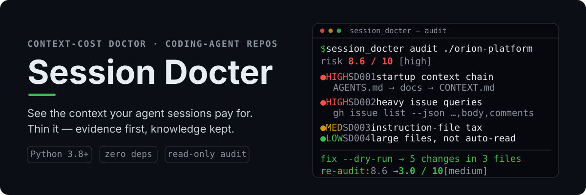
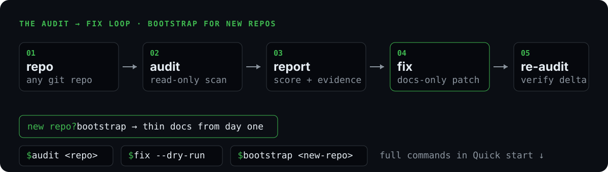

<div align="center">

**简体中文** · <a href="README.md">English</a>



[](https://www.python.org)
[](#环境要求)
[](LICENSE)

**体检你的 coding-agent 会话付出的上下文成本——然后安全地瘦身。**

</div>

## 快速开始

无需安装、零第三方依赖——只要 Python 3.8+ 标准库：

```bash
# 方式 A：单文件，十秒钟
curl -fsSL -o session_docter.py https://raw.githubusercontent.com/zj-linjie/session-docter/main/scripts/session_docter.py
python3 session_docter.py audit /path/to/your/repo

# 方式 B：克隆仓库，直接体验高风险样例
git clone https://github.com/zj-linjie/session-docter && cd session-docter
python3 scripts/session_docter.py audit fixtures/fixture_a_issue_heavy
```

`audit` 严格只读。一个高风险仓库的报告长这样：

```text
Session Docter v0.1.0
Repo: ./orion-platform
Overall risk: 8.6 / 10  [high]

HIGH   SD001  Mandatory startup context chain
       AGENTS.md:1  AGENTS.md -> docs/agents/domain.md -> CONTEXT.md (10.4 KB)
       Why: 每个会话在任何实际工作之前都要强制读完上下文文档。
       Fix: 把 CONTEXT/ADR 改为按任务条件读取；普通任务从当前 Issue 开始。

HIGH   SD002  Heavy issue/PR discovery queries
       docs/agents/workflows.md:3  list call loads full payloads for every item
       Fix: 列表只取元数据；选中 issue 后再按需拉取正文与评论。

MEDIUM SD003  Instruction file carries mutable state / fixed input tax
LOW    SD004  Large content files present (not auto-read)
```

每条 finding 都包含：severity、规则编号、证据（文件 + 行号）、为什么消耗
上下文、建议的修改、以及是否可自动修复。

## 它做什么

多步骤 agent 工作变慢变贵，往往不是因为业务代码复杂，而是因为**上下文放大**：
规则文件强制读完半个 docs 目录、issue 查询一次带出每条正文与评论、指令文件不断
堆积里程碑和机器信息、会话跨工单从不清空、验证循环在每次微小修改后重放整个
工作集。

Session Docter 用六条可解释的规则诊断这个问题，并提供三种模式：



| 模式 | 命令 | 保证 |
| --- | --- | --- |
| **audit** | `python3 scripts/session_docter.py audit <repo>` | 严格只读，支持 `--json` |
| **fix** | `... fix <repo> --dry-run` → `--apply` | 只改 agent 类 Markdown（`.md/.markdown/.mdx/.mdc`）；先展示 diff；绝不删除知识；绝不碰业务代码 |
| **bootstrap** | `... bootstrap <new-repo> --dry-run` → `--apply` | 仅限新项目；不覆盖已有文档；遇到成熟上下文体系会拒绝；apply 后自动 re-audit 且必须低风险 |

`fix` 自动化安全的部分——把 issue 列表载荷改轻、把强制阅读链改成按任务条件
路由、把整目录正文读取改成定向发现、为 AGENTS 追加会话边界与验证纪律。无法
安全自动化的（比如把易变状态拆分到可整体替换的 `STATUS.md`）会作为手工建议
给出，不会硬改。

bootstrap 生成最小骨架 `AGENTS.md + docs/PRD.md + docs/ROADMAP.md +
docs/STATUS.md`，内置薄上下文路由规则，让新项目从第一天就不长固定输入税。

## 为什么"缓存命中率高"不等于"成本低"

提示缓存让重复前缀的单价变便宜，但前缀仍然要在每一轮被处理和注意：

- 固定启动税由每个会话、每次重试、每个子代理支付；
- 每次编辑都会使缓存尾部失效，长长的易变前缀因此被反复重新计费；
- 无关材料越堆越多，注意力质量随之下降——上下文越多，漏掉那一行相关
  内容的概率越大。

最便宜的上下文是你从未加载的上下文。缓存降低的是浪费的单价；
Session Docter 降低的是浪费本身。Skill 可以重，**Context 必须薄**：
知识放在按需路由的文件里，会话里只放当前任务的输入。

## 风险评分

每条 finding 贡献一个权重——high 3.5、medium 2.5、low 0.5——总分封顶 10：

- **high（≥ 6.5）**：大额固定或重复成本，先修 P0。
- **medium（3.0–6.4）**：有边界的成本，值得排期处理。
- **low（< 3.0）**：健康；剩余项仅作提示。

评分是对话的起点，不是分数判决：每一分都能追溯到证据，有时正确答案
就是"保留它，这个成本值得"。

## 作为 Skill 使用（Codex 等）

把本仓库复制或软链到你的 agent 扫描 Skill 的目录（通常是
`~/.codex/skills/`），然后直接说：

> audit 一下这个仓库的上下文成本
> 给这个新项目初始化文档骨架

Skill 会把意图路由到正确的子命令，和你一起审阅报告，并且只有在你批准后才
应用修改。任何 apply 之后，建议做一次 A/B：用一个真实的小工单在新会话里
跑一遍，对比输入规模和会话手感。

## 它不会做什么

- 不预测账单、不读私有 telemetry、不分析隐藏 prompt。
- 不删除项目知识——PRD/CONTEXT/ADR/ROADMAP 是需要路由的事实，不是要
  清理的垃圾。
- 绝不修改业务代码。
- 不强制统一所有项目的 agent 架构。

## 开发

```bash
python3 -m unittest discover -s tests -v      # 36 个测试
python3 scripts/session_docter.py audit .     # 自体检：本仓库必须保持低风险
```

目录结构：`scripts/session_docter.py`（引擎，单文件）· `rules/`（逐规则
文档）· `fixtures/`（测试用合成样例仓库）· `assets/readme/`（视觉资产）·
`SKILL.md`（agent 操作规程）。

## 许可证

[MIT](LICENSE)
